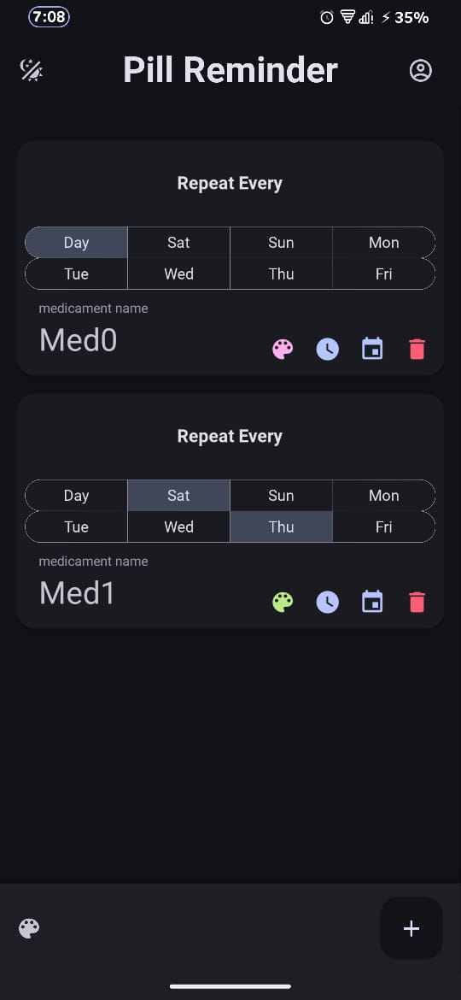
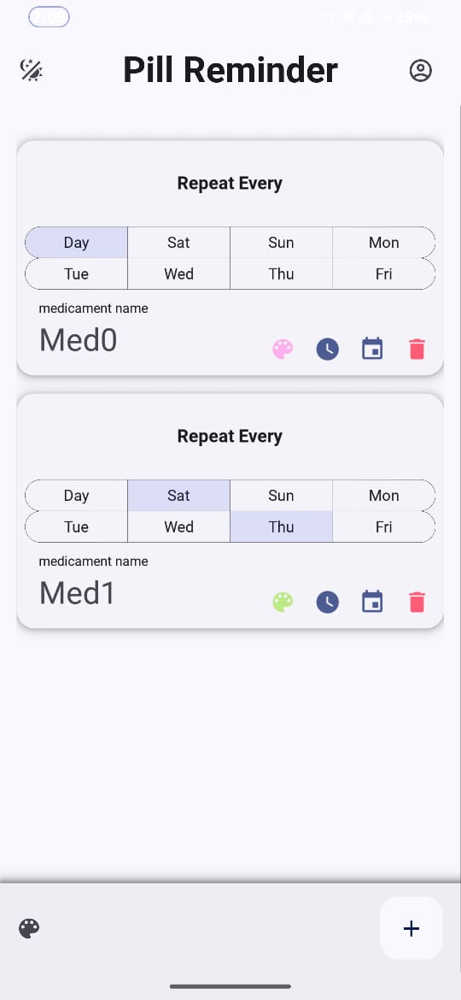

# Pill Reminder app

# Download 
[Download here](https://github.com/Osama-Abd-El-Mohsen/Pill_Reminder_App/releases/tag/V1.0)
-----------
a convenient and easy-to-use Android application designed to help you manage your medication schedule effectively. you can set up reminders for taking your pills, ensuring you never miss a dose again. Whether you're managing multiple medications or simply need a little nudge to stay on track, PillPal has you covered.

## Features

- **Customizable Reminders:** Set up reminders for each of your medications, with options to customize the frequency, dosage, and time of reminder.
- **Medication Management:** Keep track of your medications by storing details such as name, pill color, and more.
- **User-Friendly Interface:** user-friendly interface, making it easy for users of all ages to manage their medication schedules.

## Installation

   you can download the APK file from my GitHub repository

## Usage

1. **Add Medication:** Tap on the "Add Medication" button to add a new medication to your list. Enter details such as the medication name, dosage, instructions, and refill information.
2. **Set Reminders:** Once you've added your medication, set up reminders by tapping on the medication card and selecting the "Set Reminder" option. Choose the frequency, dosage, and time of reminder that suits your schedule.
3. **Manage Reminders:** View all your upcoming reminders in the main dashboard. You can easily snooze or dismiss reminders as needed.

# Screenshots : 

|   **Dark**    |    **Light**   |
|---|---|
|  |  |

## License

PillPal is licensed under the [MIT License]. Feel free to use, modify, and distribute the code as per the terms of the license.
